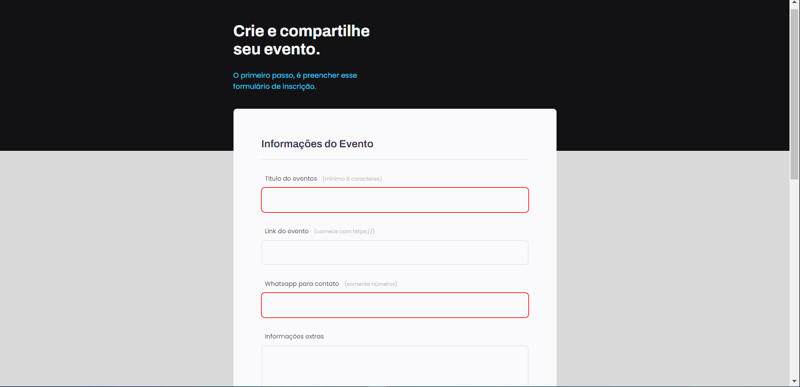

# Projeto 0.3 - Explorer 🚀

## 💻 Sobre
Layout para registrar seu evento, a parte do CSS e HTML(parte estética), esse projeto foi disponibilizado pela [Rocketseat](https://www.rocketseat.com.br/) na plataforma do [Figma](https://www.figma.com/file/miEk0LWJB7d5lnPG4WdHhX/Explorer-Stage-03-Projeto-01-(Copy)?node-id=0%3A1), para apredizado da realização de formulários.

Para o formulário pode ser "enviado" é necessário preencher alguns campos, e para destacalos foi colocado um required nos elementos de caráter obrigatório.

```html
  <input type="text" id="event-title" required/>
```

O mesmo pode ser visualizado no [aqui](https://manuelaalecio.github.io/explorer-project-03/).

## 🔨 Tecnologias

* HTML5
* CSS3

## 📄 Licensa

Este projeto está sob a licença do MIT. Consulte o arquivo [LICENSE](LICENSE) para obter mais detalhes.